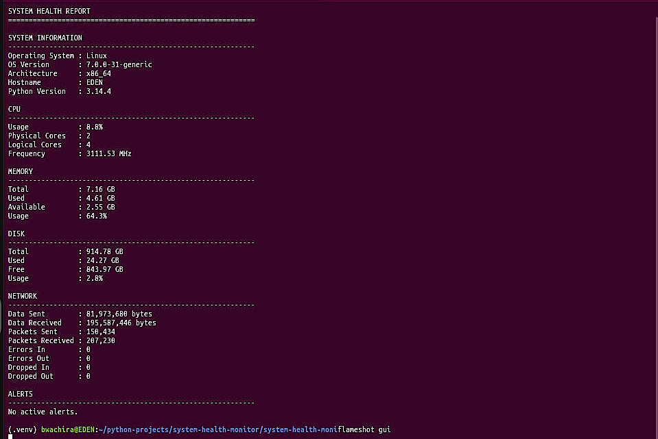
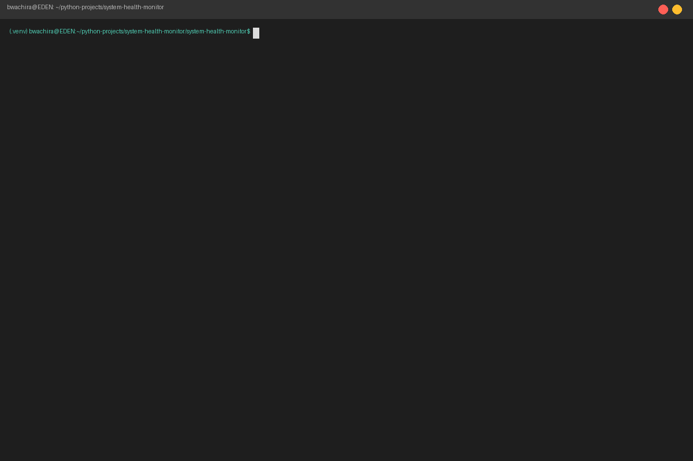
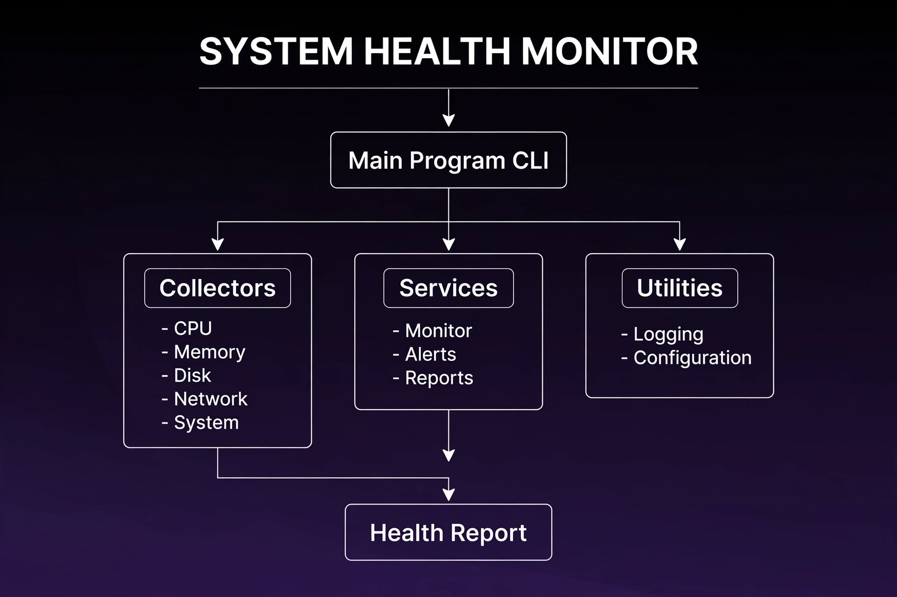

# 🖥️ System Health Monitor

> A professional Python-based system monitoring tool for observing CPU, memory, disk, network, and system health.


---

# 📌 Project Status

**Current Version:** `0.1.0`

**Status:** Active Development

The current release provides core system monitoring, configurable health thresholds, continuous monitoring, application logging, reporting, automated testing, and Python package configuration.

---

# 📸 Project Preview

### Live Monitoring



### 🎬 Demo



> Screenshots and an animated demonstration will be added as project media assets.

---

# 📌 Overview

**System Health Monitor** is a Python application designed to monitor important system resources and provide readable health reports from the command line.

The application collects information about:

- CPU usage and processor information
- Memory usage and availability
- Disk usage and free space
- Network traffic statistics
- Operating system information
- Hostname and system architecture
- Python version

It also supports configurable warning thresholds, continuous monitoring, configurable refresh intervals, application logging, and automated testing.

The project was built with a focus on **clean architecture, maintainability, testing, and practical system administration use cases**.

---

# ✨ Key Features

| Feature | Description |
|---|---|
| 🧠 CPU Monitoring | Tracks CPU utilization, physical cores, logical cores, and frequency |
| 💾 Memory Monitoring | Reports total, used, available memory and utilization |
| 💽 Disk Monitoring | Reports total, used, free disk space and utilization |
| 🌐 Network Monitoring | Tracks transmitted/received bytes, packets, errors, and dropped packets |
| 🖥️ System Information | Displays operating system, architecture, hostname, and Python version |
| 🚨 Health Alerts | Generates warnings when configured thresholds are reached |
| 🔄 Watch Mode | Continuously monitors system resources |
| ⚙️ Configurable Thresholds | Configure CPU, memory, and disk warning levels |
| ⏱️ Configurable Interval | Control how frequently monitoring information refreshes |
| 📝 Application Logging | Records important application events |
| 📄 Health Reports | Generates structured human-readable reports |
| 🧪 Automated Testing | Includes a pytest test suite |
| 📦 Python Packaging | Uses modern Python project configuration |

---

# 🛠️ Technology Stack

| Technology | Purpose |
|---|---|
| **Python 3.11+** | Application development |
| **psutil** | System and performance monitoring |
| **pytest** | Automated testing |
| **setuptools** | Python package management |
| **Git** | Version control |
| **GitHub** | Source code hosting |

---

# 🏗️ Architecture



The application separates system data collection, monitoring logic, alert generation, reporting, configuration, and logging.

```text
                    SYSTEM HEALTH MONITOR
                             │
                             ▼
                       Command Line
                          Interface
                             │
                             ▼
                    ┌─────────────────┐
                    │   Main Program  │
                    └────────┬────────┘
                             │
             ┌───────────────┼───────────────┐
             ▼               ▼               ▼
        Collectors        Services         Utilities
             │               │               │
     ┌───────┼───────┐   ┌───┼───────┐       │
     │       │       │   │   │       │       ▼
     ▼       ▼       ▼   ▼   ▼       ▼    Logging
    CPU   Memory   Disk Alerts Monitor Reports
     │       │       │
     └───────┼───────┘
             │
             ▼
          Network
             │
             ▼
       System Information
                             │
                             ▼
                       Health Report
```

---

# 📂 Project Structure

```text
system-health-monitor/
│
├── src/
│   └── system_monitor/
│       ├── __init__.py
│       ├── main.py
│       ├── config.py
│       │
│       ├── collectors/
│       │   ├── __init__.py
│       │   ├── cpu.py
│       │   ├── memory.py
│       │   ├── disk.py
│       │   ├── network.py
│       │   └── system.py
│       │
│       ├── services/
│       │   ├── __init__.py
│       │   ├── alerts.py
│       │   ├── monitor.py
│       │   └── reports.py
│       │
│       └── utils/
│           ├── __init__.py
│           └── logging_config.py
│
├── tests/
│   ├── test_cpu.py
│   ├── test_memory.py
│   ├── test_disk.py
│   ├── test_network.py
│   ├── test_system.py
│   ├── test_monitor.py
│   ├── test_alerts.py
│   ├── test_reports.py
│   └── test_logging.py
│
├── docs/
│   └── images/
│
├── .gitignore
├── LICENSE
├── README.md
├── pyproject.toml
└── requirements.txt
```

---

# 💻 Requirements

Before installing the project, make sure you have:

- Python 3.11 or newer
- Git
- A supported operating system:
  - Linux
  - Windows
  - macOS

The application uses `psutil` to access system and performance information.

---

# 🚀 Installation

## Clone the repository

```bash
git clone https://github.com/bwachira649/system-health-monitor.git
cd system-health-monitor
```

## Create a virtual environment

### Linux / macOS

```bash
python3 -m venv .venv
source .venv/bin/activate
```

### Windows

```powershell
python -m venv .venv
.venv\Scripts\activate
```

## Install the application

```bash
python -m pip install -e .
```

For development and testing:

```bash
python -m pip install -e ".[dev]"
```

---

# ▶️ Usage

## Run a health report

```bash
python -m system_monitor.main
```

The application collects the current system information and generates a readable health report.

---

# 🔄 Continuous Monitoring

```bash
python -m system_monitor.main --watch
```

The default refresh interval is **5 seconds**.

Stop monitoring with:

```text
Ctrl + C
```

---

# ⏱️ Custom Monitoring Interval

For example, refresh every 10 seconds:

```bash
python -m system_monitor.main --watch --interval 10
```

---

# 🚨 Custom Alert Thresholds

Set the CPU warning threshold to 80%:

```bash
python -m system_monitor.main --cpu-threshold 80
```

Set the memory warning threshold to 85%:

```bash
python -m system_monitor.main --memory-threshold 85
```

Set the disk warning threshold to 90%:

```bash
python -m system_monitor.main --disk-threshold 90
```

Multiple thresholds can be configured together:

```bash
python -m system_monitor.main \
    --watch \
    --interval 5 \
    --cpu-threshold 80 \
    --memory-threshold 85 \
    --disk-threshold 90
```

---

# 📝 Logging

The application records important events in a log file.

Run:

```bash
python -m system_monitor.main
```

By default, the application creates:

```text
system_monitor.log
```

A custom log location can also be specified:

```bash
python -m system_monitor.main --log-file logs/monitor.log
```

Example:

```text
2026-09-21 06:00:00 | INFO | system_monitor | System Health Monitor started.
2026-09-21 06:00:00 | INFO | system_monitor | Collecting system health information.
2026-09-21 06:00:01 | INFO | system_monitor | System health report generated successfully.
2026-09-21 06:00:01 | INFO | system_monitor | System Health Monitor finished.
```

---

# 📊 Example Output

```text
============================================================
SYSTEM HEALTH REPORT
============================================================

SYSTEM INFORMATION
------------------------------------------------------------
Operating System : Linux
OS Version       : 6.x
Architecture     : x86_64
Hostname         : example-host
Python Version   : 3.14.x

CPU
------------------------------------------------------------
Usage            : 4.0%
Physical Cores   : 2
Logical Cores    : 4
Frequency        : 3125.01 MHz

MEMORY
------------------------------------------------------------
Total            : 8.00 GB
Used             : 3.42 GB
Available        : 4.58 GB
Usage            : 42.8%

DISK
------------------------------------------------------------
Total            : 500.00 GB
Used             : 125.00 GB
Free             : 375.00 GB
Usage            : 25.0%

NETWORK
------------------------------------------------------------
Data Sent        : 41,781,709 bytes
Data Received    : 141,499,769 bytes
Packets Sent     : 78,358
Packets Received : 126,912
Errors In        : 0
Errors Out       : 0
Dropped In       : 0
Dropped Out      : 0

ALERTS
------------------------------------------------------------
No active alerts.

============================================================
```

> Values shown above are example values and will vary depending on the system running the application.

---

# 🚨 Example Alert

When a configured threshold is reached, the application can report a warning such as:

```text
ALERTS
------------------------------------------------------------
[WARNING] CPU: CPU usage is 92.4%.
[WARNING] Memory: Memory usage is 94.1%.
```

---

# 🧪 Testing

The project uses **pytest** for automated testing.

Run the complete test suite:

```bash
python -m pytest
```

Current test suite:

```text
9 passed
```

The tests cover:

- CPU monitoring
- Memory monitoring
- Disk monitoring
- Network monitoring
- System information
- Complete system snapshots
- Alert generation
- Report generation
- Application logging

---

# 🔍 Example Test Result

```text
================ test session starts ================

platform linux -- Python 3.14.4
pytest-9.0.2

collected 9 items

tests/test_alerts.py .
tests/test_cpu.py .
tests/test_disk.py .
tests/test_logging.py .
tests/test_memory.py .
tests/test_monitor.py .
tests/test_network.py .
tests/test_reports.py .
tests/test_system.py .

================= 9 passed =================
```

---

# 🧪 Development Verification

Before committing changes, the project can be verified with:

```bash
python -m pytest
```

and:

```bash
python -m system_monitor.main
```

A successful development check should confirm that:

1. The application starts successfully.
2. System metrics are collected.
3. A health report is generated.
4. Automated tests pass.
5. Application logging works correctly.

---

# 💡 Practical Use Cases

This project provides a foundation for:

- Personal computer monitoring
- Server health checks
- System administration
- Resource monitoring
- Performance troubleshooting
- Automated health checks
- Infrastructure monitoring
- DevOps environments
- Python systems programming
- Infrastructure automation

---

# 🔐 Security & Privacy

The application is designed as a local system-monitoring utility.

It:

- Reads system resource information through `psutil`.
- Does not require an external database server.
- Does not require an internet connection to collect system metrics.
- Does not intentionally transmit collected system metrics to a remote service.
- Stores application logs locally when logging is enabled.

Users should review generated logs before sharing them publicly because system information such as hostnames may appear in application output or logs.

---

# 🎯 Design Principles

The project follows several software engineering principles.

### Modular Design

System monitoring responsibilities are separated into dedicated modules.

### Maintainability

The codebase is organized so additional monitoring capabilities can be added without rewriting the entire application.

### Testability

Core functionality is covered by automated tests.

### Configurability

Monitoring thresholds and refresh intervals can be customized through command-line options.

### Observability

Application activity is recorded through structured logging.

### Cross-Platform Development

The application is designed around Python and `psutil`, allowing system information to be collected across supported operating systems.

---

# 🔮 Future Work

The current version provides the core monitoring functionality. Future versions may expand the system with additional capabilities.

## 📊 Performance Dashboard

Add an interactive dashboard displaying:

- CPU graphs
- Memory graphs
- Disk utilization
- Network traffic
- Historical performance

## 🔎 Process Monitoring

Add process-level information such as:

- Process name
- PID
- CPU usage
- Memory usage
- Running time

## 🌐 Network Interface Monitoring

Display information for individual network interfaces.

## 📈 Historical Metrics

Store monitoring results so users can analyze system performance over time.

## 📤 Report Export

Potential report formats:

- JSON
- CSV
- HTML
- PDF

## 🚨 Advanced Alerting

Potential enhancements:

- Multiple severity levels
- Custom alert rules
- Process-specific alerts
- Network alerts
- Notification integrations

## 🖥️ Web Dashboard

A future version could expose monitoring information through a web interface:

```text
System Monitor
      │
      ▼
Data Collection
      │
      ▼
Metrics Storage
      │
      ▼
API
      │
      ▼
Web Dashboard
```

## ☁️ Cloud Integration

A future version could optionally integrate monitoring metrics with cloud infrastructure or external monitoring platforms.

---
# 📸 Media & Documentation

Visual documentation demonstrates the application in operation and explains its architecture and workflow.

| Asset | Purpose |
|---|---|
| Screenshot | Show the application running |
| Animated GIF | Demonstrate the monitoring workflow |
| Architecture Diagram | Explain the application design |
| Test Screenshot | Demonstrate automated testing |
| Terminal Recording | Demonstrate CLI functionality |
| Demo Video | Provide a complete project walkthrough |

### Media Directory

```text
docs/
└── images/
    ├── system-monitor.png → Project Preview
    ├──system-monitor-demo.gif → Project Preview / Demo
    └── architecture.png → Architecture
```

# 🤝 Why This Project?

System monitoring is a practical systems and infrastructure problem.

This project was created to demonstrate the development of software that interacts with operating-system resources while following professional development practices.

It combines:

- Python development
- Linux system administration
- System monitoring
- Command-line interfaces
- Configuration management
- Application logging
- Automated testing
- Git version control
- Software documentation

---

# 📚 Technical Skills Demonstrated

This project demonstrates practical experience in:

- **Python Package Development** — Structuring and developing a reusable Python package.
- **Third-Party Libraries** — Integrating and working with external Python libraries.
- **Linux Command Line** — Using Linux terminal commands and development workflows.
- **System Resource Monitoring** — Inspecting CPU, memory, disk, and other system resources programmatically.
- **CLI Application Development** — Designing and implementing a command-line application.
- **Error Handling** — Handling invalid input, runtime errors, and unexpected system conditions.
- **Logging** — Implementing application logging for monitoring, troubleshooting, and debugging.
- **Automated Testing** — Writing and running tests to verify application functionality.
- **Git Workflows** — Using Git for version control, commits, branches, and project history.
- **GitHub Repository Management** — Managing source code, repositories, and project collaboration workflows.
- **Technical Documentation** — Creating clear, structured documentation for installation, usage, and project maintenance.

---

# 📄 License

This project is licensed under the **MIT License**.

See the [LICENSE](LICENSE) file for details.

---

# 👤 Author

## Brian Wachira

**Python Developer | Linux | AWS | Cloud & Infrastructure**

GitHub:

[https://github.com/bwachira649](https://github.com/bwachira649)

---

# ⭐ Support

If you find this project useful, consider giving the repository a ⭐ on GitHub.

---

> Built as a practical systems-monitoring project using Python, Linux, automated testing, and software engineering principles.
